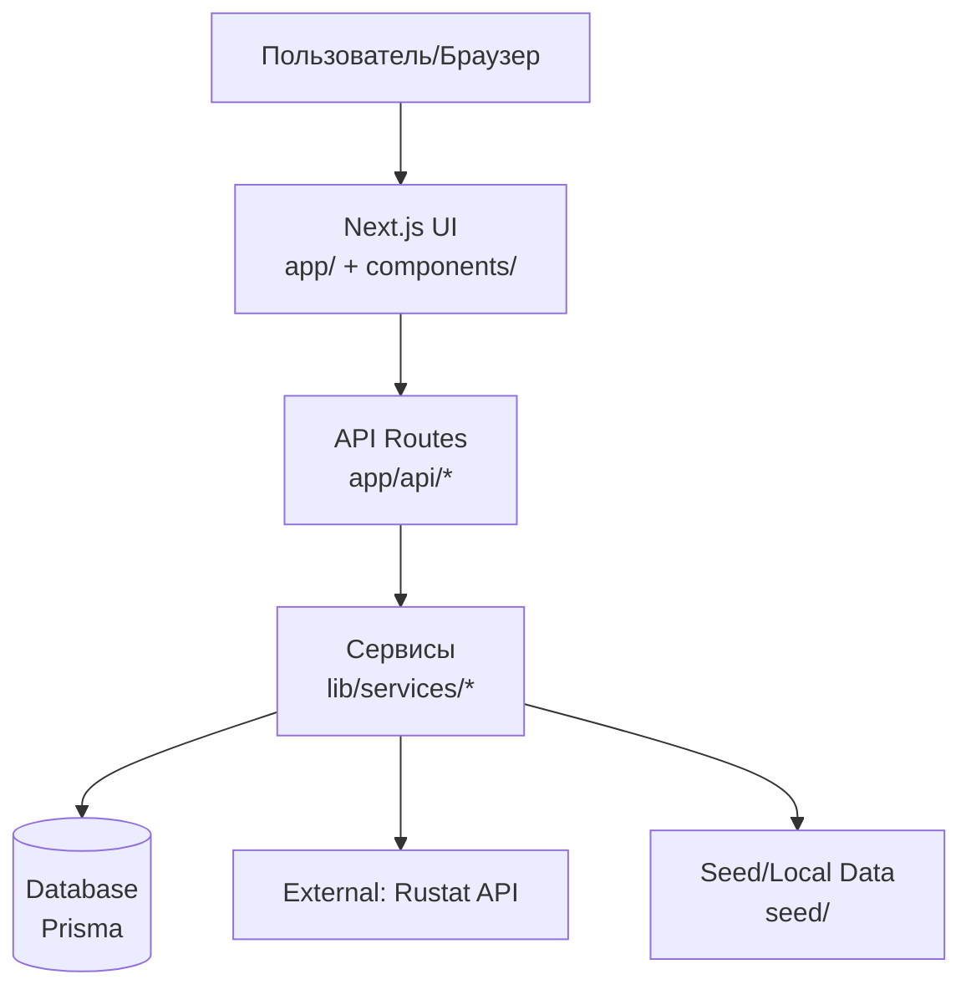
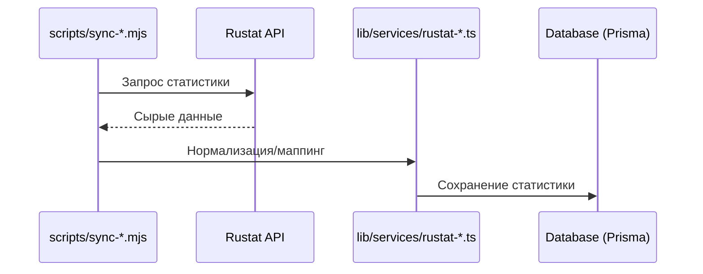
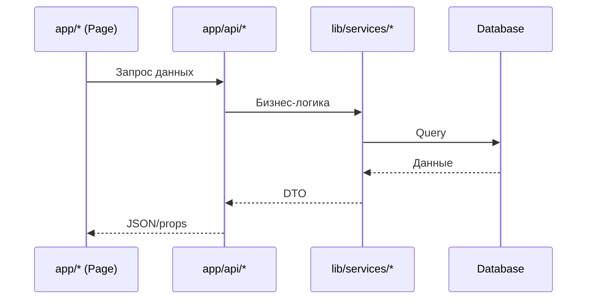
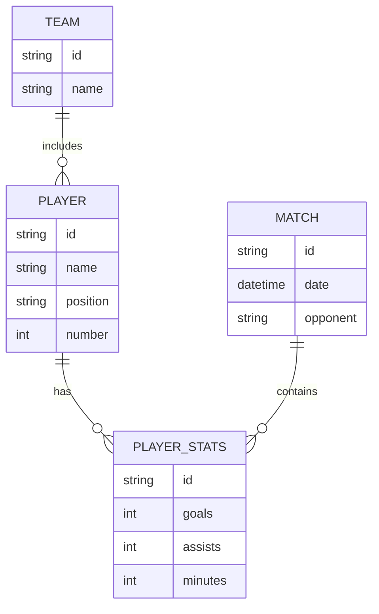

# Архитектура wfc-cska

## Краткое резюме

`wfc-cska` — публичный сайт ЖФК ЦСКА, построенный на Next.js (App Router) с серверными компонентами, API-слоем и БД через Prisma.  
Ключевой источник спортивной статистики — **Rustat**: данные матчей и игроков синхронизируются в БД и затем отображаются на страницах сайта.

---

## 1) Цели и нефункциональные требования

| Цель | Описание | Технические решения |
|---|---|---|
| Быстрый пользовательский опыт | Высокие показатели Lighthouse, мгновенная навигация | Next.js App Router, серверные компоненты, оптимизация изображений |
| Динамическая статистика | Актуальные данные матчей и игроков | Интеграция Rustat + синхронизация в БД |
| Расширяемость контента | Новости, составы, матчи, таблицы | API-слой + Prisma модели |
| Простая эксплуатация | Легкий деплой и обновления | Vercel, CI через GitHub |

---

## 2) Высокоуровневая архитектура



**Роль Rustat:** внешний источник матчевой/игроковой статистики. Данные из Rustat проходят синхронизацию и сохраняются в БД.

---

## 3) Слои и ответственность

### 3.1 UI-слой
| Компонент | Назначение | Где находится |
|---|---|---|
| Страницы | Основной рендер UI | `app/` |
| Секции и блоки | Повторно используемые части страницы | `components/sections/` |
| UI-компоненты | Кнопки, таблицы, карточки | `components/ui/` |

### 3.2 API-слой
| Группа | Назначение | Примеры |
|---|---|---|
| Players | Игроки и статистика | `app/api/players/*` |
| Matches | Матчи и статистика | `app/api/matches/*` |
| News | Новости | `app/api/news/*` |
| Standings | Турнирные таблицы | `app/api/standings/*` |

### 3.3 Сервисы и бизнес-логика
| Блок | Назначение | Где находится |
|---|---|---|
| Доступ к данным | Запросы к БД через Prisma | `lib/services/*` |
| Rustat-интеграция | Аутентификация, запросы, парсинг | `lib/services/rustat-*.ts` |
| Вспомогательные утилиты | Преобразования, фильтры | `lib/utils/*` |

### 3.4 Данные и БД
| Элемент | Назначение |
|---|---|
| Prisma schema | Модель БД | `prisma/schema.prisma` |
| Миграции | Эволюция схемы | `prisma/migrations/` |
| Сиды | Базовые данные | `prisma/seed*.ts`, `seed/` |

### 3.5 Инструменты синхронизации
| Категория | Назначение | Примеры |
|---|---|---|
| Rustat-sync | Полная/частичная синхронизация | `scripts/rustat-*.mjs`, `scripts/sync-*.mjs` |
| Импорт логотипов/новостей | Доп. контент | `scripts/download-*.mjs` |
| Проверка данных | Валидации/сверки | `scripts/check-*.mjs` |

---

## 4) Источники данных

| Источник | Тип | Назначение | Примечание |
|---|---|---|---|
| **Rustat** | Внешний API | Статистика матчей и игроков | Основной источник статистики |
| Seed-файлы | Локальные JSON | Новости, составы, логотипы | Используются для базового наполнения |
| БД (Prisma) | Локальная/прод | Все агрегированные данные | Источник для UI и API |

---

## 5) Потоки данных

### 5.1 Синхронизация статистики


### 5.2 Рендер страницы


---

## 6) Модель данных (упрощенно)



> Примечание: полный список полей см. в `prisma/schema.prisma`.

---

## 7) Основные экраны

| Страница | Назначение | Данные |
|---|---|---|
| `/` | Главная | ближайшие матчи, новости, карточки игроков |
| `/players` | Список игроков | фильтры по позиции/команде |
| `/players/[slug]` | Профиль игрока | биография, статистика (Rustat) |
| `/matches` | Матчи | расписание и результаты |
| `/matches/[slug]` | Детали матча | статистика (Rustat) |
| `/standings` | Таблица | результаты и позиции |

---

## 8) Технологический стек

| Категория | Используется |
|---|---|
| Frontend | Next.js 16, React 19, TypeScript |
| UI | Tailwind CSS, shadcn/ui |
| ORM/DB | Prisma, SQLite (dev), PostgreSQL (prod) |
| Интеграции | Rustat API |
| Деплой | Vercel |

---

## 9) Развертывание и окружения

| Окружение | Назначение | База данных | URL |
|---|---|---|---|
| Dev | локальная разработка | SQLite | `http://localhost:3000` |
| Prod | боевой сайт | PostgreSQL | `https://wfccska.ru` |

---

## 10) Конфигурация и секреты

| Переменная | Назначение |
|---|---|
| `DATABASE_URL` | Строка подключения к БД |
| `NEXT_PUBLIC_BASE_URL` | Базовый URL сайта |
| Rustat-токены | Используются в скриптах синхронизации |

> Примечание: инструкции по Rustat см. в `GET-RUSTAT-TOKEN.md` и `RUSTAT-SYNC-GUIDE.md`.

---

## 11) Точки расширения

| Задача | Где добавлять |
|---|---|
| Новый тип данных | `prisma/schema.prisma` + миграции |
| Новая интеграция | `lib/services/` |
| Новый API-эндпойнт | `app/api/` |
| Новый UI-раздел | `app/` + `components/` |

---

## 12) Риски и меры

| Риск | Митигирование |
|---|---|
| Недоступность Rustat | Кэширование в БД + повторная синхронизация |
| Большие объемы данных | Пакетная загрузка и пагинация |
| Неконсистентные данные | Скрипты проверки и нормализации |

---

## 13) Файловая структура (подробно)

```
wfc-cska/
├── app/                    # App Router, страницы и API
│   ├── api/                # API-эндпойнты
│   ├── matches/            # страницы матчей
│   ├── players/            # страницы игроков
│   └── standings/          # таблицы
├── components/             # UI-слои
├── lib/                    # сервисы, типы, утилиты
├── prisma/                 # схема БД, миграции, seed
├── scripts/                # синхронизация и импорт
├── seed/                   # локальные данные
└── public/                 # статические файлы
```

---

## 14) Что важно помнить

1. **Rustat — ключевой источник статистики.**  
2. Синхронизация статистики должна выполняться регулярно и проверяться скриптами.  
3. БД — единый источник данных для API и UI.  

